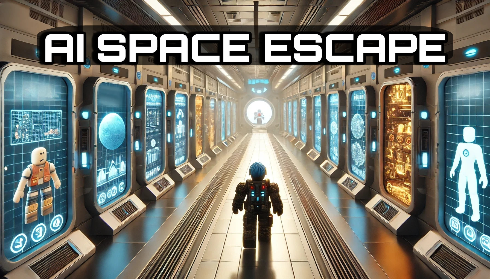

<p align="center">

</p>

<div align="center"><h1>&nbsp;AI Space Escape</h1></div>

<p align="center">
| <a href="https://arxiv.org/pdf/2412.06394"><b>Paper</b></a> | <a href="https://lmgame.org/#/blog/ai_space_escape/"><b>Blog</b></a> | <a href="https://discord.gg/pKhAhVfY"><b>Discord</b></a>  | <a href="https://x.com/largemodelgame"><b>X</b></a> |  <a href="https://www.roblox.com/games/114904064694961/AI-Space-Escape"><b>Roblox Game</b></a>
</p>

<p align="center">
  <a href="https://opensource.org/licenses/Apache-2.0">
    
  </a>
  <a href="https://github.com/lmgame-org/ai-space-escape-engine/issues">
    
  </a>
  <a href="https://github.com/lmgame-org/ai-space-escape-engine/pulls">
    
  </a>
</p>

This repo features the backend code for the Roblox game we built, [AI Space Escape](https://www.roblox.com/games/114904064694961/AI-Space-Escape), offering an unique experience to reason with AI. We design evaluation techniques to rank state-of-the-art large language models (LLMs). Our mission is to enable engaging gameplay while evaluating a variety of large-scale AI models and systems.


## AI Space Escape Engine (Interfaced with Roblox API)

### Installation

1. Clone this repository:
```
git clone https://github.com/lmgame-org/game-arena-engine.git
cd game-arena-engine
```
2. Install dependency:
```
python -m venv ./venv
.\venv\Scripts\activate.bat
pip install -r requirements.txt
```

### Set Up API Endpoints

1. Navigate to `game-arena-engine/src/config`, fill in `YOUR_API_KEY`.

### Experience the Games

1. Launch your backend with
```
python ./src/serve.py
```

2. Use [ngrok](https://ngrok.com/) to perform port forwarding to make this accessible on WAN.


### Citation
If you find this repository helpful, Please kindly cite:
```
article{hu2024gamearena,
  title={GameArena: Evaluating LLM Reasoning through Live Computer Games},
  author={Hu, Lanxiang and Li, Qiyu and Xie, Anze and Jiang, Nan and Stoica, Ion and Jin, Haojian and Zhang, Hao},
  journal={arXiv preprint arXiv:2412.06394},
  year={2024}
}
```
